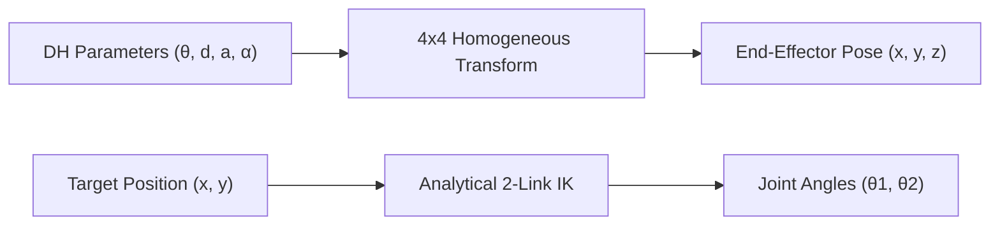

# Denavit-Hartenberg & Kinematics Engine Skill

High-performance forward and inverse kinematics solver for robotic manipulators using standard Denavit-Hartenberg (DH) parameters and analytical geometric kinematic solvers.

## Features
- **100% Python Standard Library**: Zero external dependencies.
- **Denavit-Hartenberg Parameters**: Arbitrary N-DOF serial chain forward kinematics.
- **Analytical Planar IK**: Closed-form 2-DOF elbow-up/down inverse kinematics.
- **MCP Server**: Stdio JSON-RPC 2.0 integration for AI agents.
